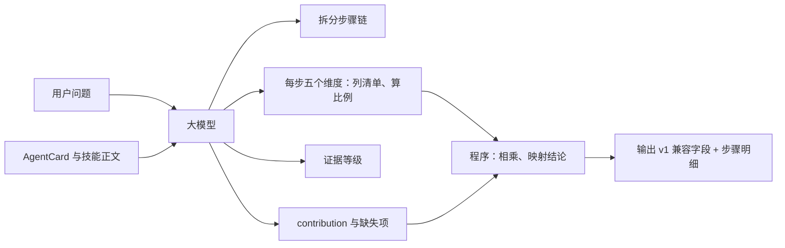

# Skill-Agent 能力检查评分标准设计

## 1. 范围与目标

本文档只解决一个问题：**当一个 Skill-Agent 收到 `capability_check` 请求时，如何根据用户问题和自身能力（`AgentCard.description` + `AgentCard.skills[].description`，后者为 `SKILL.md` 完整正文），由大模型按统一标准客观评估自己能否解决或贡献该问题。**

该标准同时适用于结构化数据智能体（表、字段、键）和非结构化数据智能体（文档库、知识库、图片、音频、纯生成 / 转换类）。两类智能体使用同一套维度、同一套公式，区别只在于各维度清单里的"项"是什么：结构化场景下是字段，非结构化场景下是信息需求项（主题、知识点、文档集、模态）。

不在本文范围内：多智能体组合规划、跨 Agent 边际价值、路由侧排序策略、概率校准与灰度发布。这些属于广播方 / 路由方的问题，本文只负责让单个 Agent 的输出**有统一标准、可横向比较**。

目标：

1. 评估对象是任务成功的必要条件，而不是主题相似度。
2. 每个维度都有明确的打分方法，大模型必须先列清单再算比例，可以逐项核对。
3. 各维度的打分由大模型完成；代码不参与任何内容判定，只按标准中的公式汇总、按规则映射结论。
4. "能独立解决"和"能贡献一部分"被分别建模，而不是混在一个分数里。
5. 输出向后兼容现有 `CapabilityCheckResponse`。

## 2. 当前机制的问题

当前 `SKILL_CAPABILITY_CHECK_PROMPT`（`agent/skill_agent.py`）让大模型直接输出 `can_handle`、`can_contribute`、`confidence`、`reason`，confidence 只给了 4 个宽区间（>= 0.8 / 0.5-0.8 / 0.3-0.5 / 0-0.2）。

问题：

- 区间内取值没有依据。日志中 user-agent 对"张三买了哪些东西"给 0.4，无法解释为什么不是 0.3 或 0.5。
- 判断依据是"领域匹配"，这是主题相似度，不等于能执行。技能是否有需要的字段、是否会做该操作、是否有输入、能否产出结果，都没有单独评估。
- 不同 Agent 打分锚点不同，0.7 和 0.7 含义可能完全不一样。
- "能贡献"只有布尔值。user-agent 对"把张三换成 user_id"这一步的能力其实是 100%，却被压成一个模糊的 0.4。
- 技能正文明确声明"不包含订单信息"时，没有规则阻止大模型给出中等分数。

## 3. 方法论：任务的链式结构

任何一个任务，本质上都是一条或多条这样的链：

```text
已知输入 ──► 访问数据/资源 ──► 执行操作 ──► 产出结果      （在给定的限定条件下）
```

复杂问题是多段链串起来。"张三买了哪些东西"：

```text
步骤 1：用户名 ──► 用户表 ──► 查找 ──► user_id
步骤 2：user_id ──► 订单表 ──► 查找 ──► 商品列表
```

非结构化任务是同一种链。"总结这份合同的风险点，并对比去年版本的变化"：

```text
步骤 1：合同文件(附件) ──► 合同文本 ──► 抽取 ──► 风险条款列表
步骤 2：合同名称 ──► 合同归档库 ──► 检索 ──► 去年版本文本
步骤 3：风险条款列表 + 去年版本文本 ──► （无外部数据） ──► 对比 ──► 变化说明
```

两种场景下步骤间的依赖形态相同：上一步的产出是下一步的输入。区别只是产物是一个键值（`user_id`）还是一段信息（风险条款列表、去年版本文本）。

由此得到两个定义：

- **能独立解决**：Agent 能独立走完所有步骤。
- **能贡献**：Agent 能独立走完其中某一步，且这一步的产出是后续步骤的输入，或本身就是用户要的结果之一。

评估对象因此不是"整个问题"，而是**每个步骤上的五个必要条件**。五个条件必须同时成立，缺一环任务即失败，所以用相乘而不是加权求和。

## 4. 评估流程



分工：

- **大模型**：把问题拆成步骤；对每一步、每个维度先列出所需项和命中项，再给出比例；给出证据等级；书写 contribution 和缺失项。
- **程序**：把评分标准放进 prompt；接收结构化输出；按第 7 节公式计算；按第 8 节规则映射 `can_handle` / `can_contribute` / `confidence`。程序中不存在任何"根据文本内容决定分值"的逻辑。

唯一由程序判断的前置事实是 `agent_card.skills` 是否为空：为空时不调用大模型，直接返回 confidence = 0。这是运行状态，不是能力评价。

## 5. 步骤拆分

大模型先把问题拆成有序步骤，每步包含：

| 字段 | 说明 |
|------|------|
| `step_id` | 顺序编号 |
| `inputs` | 该步骤需要的输入项，每项标注来源：`query`（问题文本或用户附带的文件、图片等附件）/ `upstream`（上一步产出）/ `missing`（都没有） |
| `data_objects` | 该步骤要访问的信息需求项：结构化场景为实体与字段；非结构化场景为主题、知识点、文档集、模态；纯生成 / 转换步骤为空 |
| `operation` | 操作类别，见下表 |
| `outputs` | 该步骤要产出的项（字段值、列表、摘要、译文、分类标签、图表等） |
| `constraints` | 该步骤受到的限定条件（时效、权限、范围、规模、精度、合规、语言、版本），没有则为空 |
| `is_final` | 产出是否就是用户要的最终结果 |

操作类别：

| 类别 | 含义 | 典型场景 |
|------|------|----------|
| `lookup` | 按键或条件定位记录 | 结构化查询 |
| `filter` | 按条件筛选 | 结构化 / 列表 |
| `aggregate` | 统计、分组、排序 | 结构化 |
| `retrieve` | 在文档库 / 知识库中检索相关内容 | 非结构化 |
| `extract` | 从文本、图片、音频中抽取信息 | 非结构化 |
| `summarize` | 归纳、摘要 | 非结构化 |
| `classify` | 分类、打标签、判定 | 两者 |
| `compare` | 对比两组数据或两份内容 | 两者 |
| `translate` | 语言或格式转换 | 非结构化 |
| `generate` | 基于输入创作新内容 | 非结构化 |
| `modify` | 写入、删除、更新外部状态 | 两者 |

拆分原则：一步只做一种操作、访问一类数据；上一步的输出必须是下一步的输入，否则不拆。单一简单问题就是一步。

## 6. 五个维度与打分方法

每个步骤各评一次。前四个维度是比例分，要求大模型**先列清单、逐项核对、再算比例**；操作维度是三档。

### 6.1 I 输入匹配

| 项目 | 内容 |
|------|------|
| 定义 | 该步骤所需输入，问题或上一步给了多少 |
| 打分 | 列出所需输入项；逐项判断是否已提供且类型 / 模态可用；`I = 可用项 / 所需项` |
| 特例 | 来源为 `upstream` 的输入按可用计，但必须写入 `missing_requirements`，供请求方判断是否需要其他 Agent 先做上一步。输入模态与技能不匹配（技能只处理文本，输入是图片）记为不可用 |
| 依据 | 问题原文中的值和附件；技能正文中声明的输入条件、支持的输入格式 |

### 6.2 D 信息覆盖

| 项目 | 内容 |
|------|------|
| 定义 | 该步骤要读写的信息需求项，技能的数据源 / 知识源里有多少 |
| 打分 | 列出所需信息项；逐项在技能正文声明的覆盖范围中核对；`D = 命中项 / 所需项` |
| 结构化 | 信息项 = 实体与字段；核对对象 = 字段列表、数据格式说明 |
| 非结构化 | 信息项 = 主题、知识点、文档集、时间版本、模态；核对对象 = 技能正文的覆盖范围声明（主题清单、来源、版本、支持的模态） |
| 特例 1 | 技能正文明确写"不包含 X / 不支持 X / 不覆盖 X / 请使用其他技能查询 X"的，X 对应项直接记未命中 |
| 特例 2 | 该步骤不需要访问任何外部数据 / 知识（纯生成、纯转换、对上游产物的加工），D = 1.0，与 C 无约束时的处理一致 |
| 特例 3 | 信息项属于技能声明主题的子项（"年假"属于"请假制度"），可记命中，但证据等级不得高于 B |
| 依据 | 技能正文的字段列表、数据格式、覆盖范围声明、排除项 |

D 直接核对信息项，因此不再需要"领域匹配"这个维度——领域匹配只是 D 的粗糙代理。非结构化场景下 D 的可核对程度取决于技能正文对覆盖范围的声明是否清晰，这一要求见第 10 节。

D 判断的是"技能是否拥有这类信息源"，不判断"具体答案是否一定在里面"。张三可能不在用户表里，年假规则可能没被某一页文档写到，这是数据实例问题，两类场景处理一致：不影响能力分，可在 `risks` 中提示。

### 6.3 O 操作能力

| 项目 | 内容 |
|------|------|
| 定义 | 该步骤要做的变换，技能能不能做 |
| 打分 | 三档：技能正文明确描述该操作或给出等价命令 / 流程 = **1.0**；正文未明确描述，但技能允许的工具或已声明的能力可以直接组合完成 = **0.7**；不能做、明确不支持、或需要技能没有的工具类别 = **0** |
| 说明 | 操作是"会或不会"的性质，不适合比例；0.7 表示"可以做但没有现成路径，存在执行不确定性"。摘要、翻译、生成类操作的质量不确定性也由这一档承担，不进 R |
| 依据 | 技能正文的命令示例、脚本说明、处理流程描述、`allowed_tools` |

### 6.4 R 结果匹配

| 项目 | 内容 |
|------|------|
| 定义 | 该步骤要产出的项 / 形态，技能的输出能满足多少 |
| 打分 | 列出期望产出项（含形态要求，如列表、数量、图表、摘要、译文、标签）；逐项判断技能能否输出该项及该形态；`R = 可产出项 / 期望项` |
| 说明 | R 只判"能不能产出这个形态的结果"，不判质量 |
| 依据 | 技能正文的输出字段、返回格式、输出形态说明 |

### 6.5 C 约束满足

| 项目 | 内容 |
|------|------|
| 定义 | 问题里显式或隐含的限定条件，技能能满足多少 |
| 打分 | 列出该步骤的约束项：时效（实时 / 快照）、权限与副作用（只读 / 可写）、数据范围（区域 / 租户 / 时间跨度）、规模、精度、合规、语言、文档版本；逐项对照技能正文；`C = 满足项 / 约束项`；**没有约束时 C = 1.0** |
| 依据 | 技能正文中的数据同步说明、权限声明、覆盖范围说明、语言 / 版本说明、`allowed_tools` |

大多数简单查询 C 恒为 1.0；一旦问题出现"实时""全部""删除""近三年""敏感""英文版""最新版"等词，C 开始生效。

### 6.6 打分要求（写入 prompt）

- 每个比例分必须先写出清单（所需项、命中项），再给比例；只给数字不给清单视为无效。
- 依据必须引用技能正文、技能短描述、`Agent_Description` 或问题原文，并注明来源类别。
- 技能正文没写的能力视为没有；禁止根据 Agent 名称、行业常识或"通常应该有"推断。非结构化技能尤其如此：正文只写"公司内部文档问答"而没有主题清单时，任何具体主题都不能记命中，证据等级记 C。
- 技能正文明确"不包含 / 不支持 / 不覆盖"的内容，对应项直接记未命中。
- 各维度独立核对各自的清单，不允许为了让总分好看而调整某个维度。

## 7. 汇总公式（程序执行）

### 7.1 步骤能力分

```text
step_score = I × D × O × R × C
```

相乘的含义：五个条件缺一不可。任何一项为 0，该步骤即不可完成，不需要额外的封顶或修正规则。

### 7.2 整体能力分

```text
handle_score = Π step_score（所有步骤）
```

### 7.3 阈值

```text
THRESHOLD = 0.7
```

0.7 对应"一个维度存在明确但不致命的缺口"（如 O 取 0.7，或 4 项中命中 3 项）。低于此值说明至少两处缺口或一处严重缺口。该值为初始值，可通过环境变量调整。

## 8. 结论映射（程序执行）

```text
can_handle     = handle_score >= THRESHOLD
                 且 所有步骤的 inputs 中没有来源为 upstream 且本 Agent 无法自行产出的项

can_contribute = can_handle
                 或 存在某一步 step_score >= THRESHOLD
                    且（该步 is_final = true 或 其 outputs 是后续某步的 inputs）
                    且 contribution 三要素齐全

confidence     = can_handle 时取 handle_score
                 只能贡献时取满足条件的步骤中 step_score 的最大值
                 都不能时为 0
```

`can_handle = true` 时自动置 `can_contribute = true`，与现有 `_normalize_capability_result()` 语义一致。

### 8.1 contribution 的书写标准

`can_contribute` 候选时，大模型按三要素书写 `contribution`，并输出 `contribution_complete: bool` 自评是否齐全。程序仅在 `contribution` 为空或 `contribution_complete = false` 时将 `can_contribute` 置为 `false`。

1. 输入：使用问题中的哪个已知值，或需要补齐哪个缺失值；
2. 输出：产出哪个具体项（字段值、列表、摘要、译文等）；
3. 用途：该项对应哪个后续步骤的输入，或最终结果的哪一部分。

合格：`输入 username=张三，输出 user_id，供步骤 2 查询订单使用`。
不合格：`可以提供相关用户信息`、`可以补充辅助数据`。

## 9. 证据等级（单独输出，不进乘法）

证据等级衡量的是"这次判断有多可信"，不是"Agent 有多能干"，因此不折进能力分，单独输出供请求方参考。

| 等级 | 标准 |
|------|------|
| A | 各维度依据全部来自技能正文中的明确内容：字段列表、数据格式、命令示例（结构化）；主题清单、来源、版本、处理流程、排除项（非结构化） |
| B | 主要来自技能正文，个别维度只能依赖技能短描述 |
| C | 主要依赖技能短描述或 `Agent_Description`，正文无对应内容 |
| D | 缺乏文本依据，含推测成分 |

请求方看到 `confidence = 0.9, evidence = C` 即可知这是凭描述推出的高分，可自行决定采信程度。

## 10. 对技能正文的要求

评分的可核对程度取决于 `SKILL.md` 正文是否给出了各维度需要的事实。正文没写的一律视为没有，因此技能作者需要按下表补齐声明。两类技能的要求是对称的，只是"覆盖范围"的表达方式不同。

| 维度 | 结构化技能必须声明 | 非结构化技能必须声明 |
|------|--------------------|----------------------|
| I | 查询条件、输入参数及类型 | 支持的输入形态与模态（文本、PDF、图片、URL）、语言 |
| D | 实体、字段列表、数据格式 | 覆盖的主题清单、来源 / 文档集、时间版本范围、支持的模态 |
| O | 命令示例、脚本说明、`allowed_tools` | 处理流程（检索 / 抽取 / 摘要 / 翻译 / 生成）、`allowed_tools` |
| R | 输出字段、返回格式 | 输出形态（问答、摘要、列表、表格、译文、标签） |
| C | 数据同步周期、读写权限、数据范围 | 文档更新周期、版本、语言、权限、是否只读 |
| 排除项 | "不包含 X，请使用 Y 技能" | "不覆盖 X 主题 / 不做 Y 操作" |

排除项在两类技能中同样重要：它是让 D 或 O 直接记 0 的唯一硬依据，缺少排除项时大模型只能靠"没写"来判断，证据等级会降低。

## 11. 刻意不作为维度的因素

| 候选 | 处理方式 | 原因 |
|------|---------|------|
| 领域匹配 | 不设 | 是 D 的粗糙代理，D 直接核对信息项后它没有独立信息量 |
| 结构化 / 非结构化类型 | 不设 | 两类智能体走同一套维度，差别体现在清单里的"项"是字段还是信息项，不需要单独的维度或分支公式 |
| 输出质量（摘要好不好、译文准不准） | 由 O 的 0.7 档与证据等级承担 | 能力检查是执行前评估，无法验证质量；只能表达"有无现成路径"的不确定性 |
| 证据强度 | 单独输出为等级 | 衡量判断可信度，不是能力 |
| 历史执行成功率 | 未来作为外部修正项 | 无法从技能正文判断，属于运行时反馈 |
| 调用成本、延迟 | 不设 | 路由方的选择依据，不是"能不能做" |
| 结果唯一性（如"张三"有多人） | 写入 reason 作为风险提示 | 数据本身的属性，不影响能力 |

## 12. 案例

### 12.1 张三买了哪些东西 —— user-agent

技能 `user_query`，正文关键内容：字段 `用户ID|用户名|电话|邮箱`；`grep "张三" data/users.txt`；"用户数据中不包含订单信息，如需获取用户的订单数据，请使用 order_query 技能"。

**步骤拆分**

```text
步骤 1：username(query) → 用户表[用户名, 用户ID] → lookup → user_id          is_final=false
步骤 2：user_id(upstream) → 订单表[订单, 商品] → lookup → 商品列表           is_final=true
```

**步骤 1**

| 维度 | 清单 | 分值 |
|------|------|------|
| I | 所需：用户名。问题已给"张三" | 1/1 = 1.0 |
| D | 所需：用户名、用户ID。字段列表两项都有 | 2/2 = 1.0 |
| O | lookup。正文有 grep 示例 | 1.0 |
| R | 期望：user_id。可输出用户ID | 1/1 = 1.0 |
| C | 无约束 | 1.0 |

step_score = 1.0

**步骤 2**

| 维度 | 清单 | 分值 |
|------|------|------|
| I | 所需：user_id（upstream） | 1.0，记入 missing_requirements |
| D | 所需：订单、商品。正文明确"不包含订单信息" | 0/2 = 0 |
| O | lookup | 1.0 |
| R | 期望：商品列表。无对应字段 | 0/1 = 0 |
| C | 无约束 | 1.0 |

step_score = 0

**结论**

```text
handle_score   = 1.0 × 0 = 0            → can_handle = false
步骤 1 = 1.0 ≥ 0.7，且 user_id 是步骤 2 的输入 → can_contribute = true
confidence     = 1.0
evidence       = A
contribution   = 输入 username=张三，输出 user_id，供步骤 2 查询订单使用
```

旧机制给 0.4。新机制表明：这个 Agent 对它能做的那一步，能力是满分；它不能做的那一步，是 0。两个数都可逐项追溯。

### 12.2 张三买了哪些东西 —— order-agent

技能 `order_query`，正文关键内容：字段 `订单ID|用户ID|商品名|金额|下单时间`；`grep "U001" data/orders.txt`；"按用户ID查询，不含用户名"。

**步骤 1**：D 所需用户名，技能无 → 0/2，step_score = 0。

**步骤 2**

| 维度 | 清单 | 分值 |
|------|------|------|
| I | 所需：user_id（upstream，问题未给） | 1.0，记入 missing_requirements |
| D | 所需：订单、商品名。都有 | 2/2 = 1.0 |
| O | lookup。有 grep 示例 | 1.0 |
| R | 期望：商品列表。可输出商品名 | 1/1 = 1.0 |
| C | 无约束 | 1.0 |

step_score = 1.0

**结论**

```text
handle_score = 0 × 1.0 = 0              → can_handle = false
步骤 2 = 1.0 ≥ 0.7，且 is_final = true    → can_contribute = true
confidence   = 1.0
evidence     = A
missing_requirements = ["user_id"]
contribution = 需补齐 user_id，输出该用户的商品列表，对应最终结果
```

### 12.3 操作需要自行组合 —— order-agent

问题："统计上个月每个商品的销量排名"

单步：时间范围(query) → 订单表[商品名, 下单时间] → aggregate → 商品 + 销量 + 排名，is_final = true。

| 维度 | 清单 | 分值 |
|------|------|------|
| I | 所需：时间范围。问题给"上个月" | 1.0 |
| D | 所需：商品名、下单时间。都有 | 2/2 = 1.0 |
| O | 过滤 + 分组计数 + 排序。正文只有单条 grep 示例，但 allowed_tools 含 awk/sort/uniq 可组合 | 0.7 |
| R | 期望：商品、销量、排名。可产出 | 3/3 = 1.0 |
| C | 约束：上个月（时间范围）。有下单时间字段 | 1/1 = 1.0 |

```text
step_score = 1.0 × 1.0 × 0.7 × 1.0 × 1.0 = 0.7
can_handle = true（刚达阈值）
confidence = 0.7，evidence = A
```

0.7 的含义明确：数据、输入、输出都没问题，唯一不确定在于操作需要自行组合工具。

### 12.4 约束不满足 —— order-agent

问题："查一下张三最近 30 天的实时订单，删除其中未付款的"

技能正文补充：数据 `data/orders.txt` 每日凌晨同步；字段含支付状态；`allowed_tools` 只有 `cat/grep/awk`。

**步骤 1**：user_id + 时间范围 → 未付款订单列表

| 维度 | 清单 | 分值 |
|------|------|------|
| I | user_id（upstream）、时间范围（query） | 2/2 = 1.0 |
| D | 下单时间、支付状态、订单ID | 3/3 = 1.0 |
| O | filter，awk 可做 | 1.0 |
| R | 订单列表 | 1.0 |
| C | 约束 2 项：实时 → 数据为每日快照，不满足；近 30 天 → 有时间字段，满足 | 1/2 = 0.5 |

step_score = 0.5

**步骤 2**：订单列表 → 删除

| 维度 | 清单 | 分值 |
|------|------|------|
| O | modify。无写工具 | 0 |
| C | 副作用约束：技能只读 | 0 |

step_score = 0

**结论**：`can_handle = false`；步骤 1 = 0.5 < 0.7，`can_contribute = false`；reason 明确写出"数据非实时、无删除权限"。旧机制很可能因"领域匹配"给出 0.7 以上。

### 12.5 非结构化知识库问答 —— hr-policy-agent

技能 `hr_policy_qa`，正文关键内容：覆盖 HR 制度文档，主题包括考勤、请假、报销、差旅、福利；文档版本 2022–2025，每季度更新；处理流程为检索相关章节后摘要回答；输入为中文问题文本；输出为文本回答并附出处；"不覆盖薪酬体系与期权相关内容"。

问题："去年入职的员工今年能休几天年假？期权归属规则是什么？"

**步骤拆分**

```text
步骤 1：入职时间(query) → 请假制度文档[年假规则, 入职年限换算] → retrieve+summarize → 年假天数   is_final=true
步骤 2：（无输入）      → 期权制度文档[归属规则]                 → retrieve+summarize → 归属规则   is_final=true
```

两步互不依赖，各自都是最终结果的一部分。

**步骤 1**

| 维度 | 清单 | 分值 |
|------|------|------|
| I | 所需：入职时间。问题给"去年" | 1/1 = 1.0 |
| D | 信息项：年假天数规则、入职年限换算。正文主题"请假"覆盖，年假为其子项 | 2/2 = 1.0（特例 3，证据 B） |
| O | retrieve+summarize。正文明确描述该流程 | 1.0 |
| R | 期望：天数（文本）。输出文本回答 | 1/1 = 1.0 |
| C | 约束：今年 → 版本覆盖到 2025 | 1/1 = 1.0 |

step_score = 1.0

**步骤 2**

| 维度 | 清单 | 分值 |
|------|------|------|
| I | 无所需输入 | 1.0 |
| D | 信息项：期权归属规则。正文明确"不覆盖期权" | 0/1 = 0 |
| O | retrieve+summarize | 1.0 |
| R | 期望：规则说明 | 1/1 = 1.0 |
| C | 无约束 | 1.0 |

step_score = 0

**结论**

```text
handle_score   = 1.0 × 0 = 0            → can_handle = false
步骤 1 = 1.0 ≥ 0.7，且 is_final = true    → can_contribute = true
confidence     = 1.0
evidence       = B
contribution   = 输入 入职时间=去年，输出 年假天数及出处，对应最终结果的年假部分；期权部分需其他 Agent
```

形态与 12.1 完全一致。清单里的项从"用户名、用户ID"换成了"年假规则、入职年限换算"，公式没有变化。

### 12.6 非结构化多步依赖 —— contract-review-agent

技能 `contract_review`，正文关键内容：输入 PDF / Docx 合同文件，支持中英文；支持条款抽取与风险标注，风险规则库覆盖采购、劳动、租赁合同；输出风险条款列表（条款号、原文、风险等级、说明）；"不提供合同归档检索，历史版本需由调用方提供"；"不做翻译"。

问题："总结这份英文采购合同的风险点，并对比去年版本的变化"（附件：合同 PDF）

**步骤拆分**

```text
步骤 1：合同文件(query 附件) → 合同文本 → extract → 风险条款列表                is_final=true
步骤 2：合同名称(query)      → 合同归档库 → retrieve → 去年版本文本              is_final=false
步骤 3：风险条款列表(upstream) + 去年版本文本(upstream) → （无外部数据） → compare → 变化说明   is_final=true
```

**步骤 1**

| 维度 | 清单 | 分值 |
|------|------|------|
| I | 所需：合同文件（PDF）。附件已给，模态支持 | 1/1 = 1.0 |
| D | 信息项：采购合同风险规则。规则库覆盖采购合同 | 1/1 = 1.0 |
| O | extract + 风险标注。正文明确 | 1.0 |
| R | 期望：风险条款列表。输出格式一致 | 1/1 = 1.0 |
| C | 约束：英文。正文声明支持中英文 | 1/1 = 1.0 |

step_score = 1.0

若正文没有写支持的语言，只写了"不做翻译"，则不能推断支持英文，C = 0/1，step_score = 0。这一差别只取决于技能正文有没有写，见第 10 节。

**步骤 2**：D 所需合同归档库，正文明确"不提供合同归档检索" → 0/1 → step_score = 0

**步骤 3**

| 维度 | 清单 | 分值 |
|------|------|------|
| I | 所需：风险条款列表（upstream，步骤 1 本 Agent 可产出）、去年版本文本（upstream，步骤 2 本 Agent 不能产出） | 2/2 = 1.0，后者记入 missing_requirements |
| D | 不需要外部数据（对上游产物加工） | 1.0（特例 2） |
| O | compare。正文只说抽取与标注，未描述版本对比；allowed_tools 含文本处理工具可组合 | 0.7 |
| R | 期望：变化说明 | 1/1 = 1.0 |
| C | 无约束 | 1.0 |

step_score = 0.7

**结论**

```text
handle_score = 1.0 × 0 × 0.7 = 0        → can_handle = false
步骤 1 = 1.0 ≥ 0.7 且 is_final = true；步骤 3 = 0.7 ≥ 0.7 且 is_final = true → can_contribute = true
contributing_steps = [1, 3]
confidence   = max(1.0, 0.7) = 1.0
evidence     = A
missing_requirements = ["去年版本合同文本（步骤 2，本 Agent 不提供归档检索）"]
contribution = 输入 合同PDF，输出 风险条款列表（对应最终结果的风险部分）；若补齐 去年版本文本，可进一步输出 两版差异说明（对应对比部分）
```

这个案例说明三点：附件作为 `query` 来源的输入；上游依赖跨 Agent 时如何写入 `missing_requirements`；非结构化步骤上 D 的特例 2 与 O 的 0.7 档如何配合。

## 13. 输出协议

保留现有字段，新增可选字段。旧消费者忽略新字段即可。

```json
{
  "can_handle": false,
  "can_contribute": true,
  "confidence": 1.0,
  "contribution": "输入 username=张三，输出 user_id，供步骤 2 查询订单使用",
  "reason": "步骤1（用户名→user_id）：I=1/1 D=2/2 O=1.0 R=1/1 C=1.0，能力分 1.0。步骤2（user_id→商品列表）：D=0/2 技能正文明确不包含订单信息，R=0/1，能力分 0。不能独立完成；可贡献步骤 1。",

  "score_version": "capability-chain-v1",
  "evidence_grade": "A",
  "threshold": 0.7,
  "handle_score": 0.0,
  "steps": [
    {
      "step_id": 1,
      "operation": "lookup",
      "is_final": false,
      "inputs": [{"name": "username", "source": "query"}],
      "outputs": ["user_id"],
      "scores": {"I": 1.0, "D": 1.0, "O": 1.0, "R": 1.0, "C": 1.0},
      "step_score": 1.0,
      "checklists": {
        "I": {"required": ["username"], "available": ["username"]},
        "D": {"required": ["用户名", "用户ID"], "matched": ["用户名", "用户ID"]},
        "R": {"expected": ["user_id"], "producible": ["user_id"]},
        "C": {"constraints": [], "satisfied": []}
      },
      "evidence": ["字段：用户ID|用户名|电话|邮箱", "grep \"张三\" data/users.txt"]
    },
    {
      "step_id": 2,
      "operation": "lookup",
      "is_final": true,
      "inputs": [{"name": "user_id", "source": "upstream"}],
      "outputs": ["商品列表"],
      "scores": {"I": 1.0, "D": 0.0, "O": 1.0, "R": 0.0, "C": 1.0},
      "step_score": 0.0,
      "checklists": {
        "D": {"required": ["订单", "商品"], "matched": []},
        "R": {"expected": ["商品列表"], "producible": []}
      },
      "evidence": ["用户数据中不包含订单信息"]
    }
  ],
  "contributing_steps": [1],
  "missing_requirements": ["订单/购买记录数据（步骤 2）"]
}
```

`reason` 由大模型按固定结构书写：逐步骤列出五个维度的比例与能力分，最后一句给结论。结构固定便于日志检索与横向比对。

## 14. 大模型工具 Schema

替换现有 `CapabilityCheckToolResult`。大模型输出步骤、清单、比例、证据等级、contribution；不输出最终 `confidence` 与布尔结论。

```python
class InputItem(BaseModel):
    name: str
    source: Literal["query", "upstream", "missing"]

class RatioCheck(BaseModel):
    required: list[str]
    matched: list[str]
    ratio: float = Field(ge=0, le=1)      # = len(matched) / len(required)；required 为空时为 1.0

class StepEvaluation(BaseModel):
    step_id: int
    operation: Literal["lookup", "filter", "aggregate", "retrieve", "extract", "summarize",
                       "classify", "compare", "translate", "generate", "modify"]
    is_final: bool
    inputs: list[InputItem]
    outputs: list[str]
    constraints: list[str]

    input_match: RatioCheck               # I
    data_coverage: RatioCheck             # D；required 为字段或信息项；无外部数据需求时 required 为空、ratio = 1.0
    operation_capability: Literal[0.0, 0.7, 1.0]   # O
    result_match: RatioCheck              # R
    constraint_satisfaction: RatioCheck   # C

    evidence: list[str]                   # 原文引用 + 来源类别

class CapabilityChainResult(BaseModel):
    steps: list[StepEvaluation]
    evidence_grade: Literal["A", "B", "C", "D"]
    contribution: str
    contribution_complete: bool
    missing_requirements: list[str]
    risks: list[str]                      # 如结果唯一性等提示，不影响分值
    reason: str
```

Prompt 需包含：第 3 节的链式定义、第 5 节的拆分规则、第 6 节全部维度的打分方法与要求、第 7-8 节的公式与规则（供大模型理解结果含义）、第 8.1 节的 contribution 标准、第 9 节的证据等级标准、第 10 节中"正文没写视为没有"的核对原则。

## 15. 程序侧汇总

程序只做算术与映射，示意如下：

```python
THRESHOLD = float(os.getenv("CAPABILITY_CHAIN_THRESHOLD", "0.7"))

def step_score(s: StepEvaluation) -> float:
    return (s.input_match.ratio * s.data_coverage.ratio * s.operation_capability
            * s.result_match.ratio * s.constraint_satisfaction.ratio)

def aggregate(r: CapabilityChainResult) -> CapabilityCheckResponse:
    scores = [step_score(s) for s in r.steps]
    handle_score = math.prod(scores) if scores else 0.0

    has_external_dependency = any(
        i.source in ("upstream", "missing") and not produced_by_earlier_step(i, s, r.steps)
        for s in r.steps for i in s.inputs
    )
    can_handle = handle_score >= THRESHOLD and not has_external_dependency

    downstream_inputs = {i.name for s in r.steps for i in s.inputs if i.source == "upstream"}
    contributing = [
        s for s, sc in zip(r.steps, scores)
        if sc >= THRESHOLD and (s.is_final or any(o in downstream_inputs for o in s.outputs))
    ]
    contribution_ok = bool(r.contribution.strip()) and r.contribution_complete
    can_contribute = can_handle or (bool(contributing) and contribution_ok)

    if can_handle:
        confidence = handle_score
    elif can_contribute:
        confidence = max(step_score(s) for s in contributing)
    else:
        confidence = 0.0

    return build_response(can_handle, can_contribute, round(confidence, 2), handle_score, r)
```

`produced_by_earlier_step` 只做名称匹配：某个 `upstream` 输入是否出现在更早步骤的 `outputs` 中。代码中没有任何依据文本内容给分或改分的逻辑。

## 16. 代码落点

| 文件 | 改动 |
|------|------|
| `agent/skill_agent.py` | 用 `CapabilityChainResult` 替换 `CapabilityCheckToolResult`；重写 `SKILL_CAPABILITY_CHECK_PROMPT`，内容为第 3、5、6、8.1、9、10 节的标准；`handle_capability_check()` 在技能为空时直接返回 0，否则调用大模型后交给 `aggregate()` |
| `agent/capability_chain.py`（新增） | `THRESHOLD`、`step_score()`、`aggregate()`、`build_response()`、prompt 标准文本常量 |
| `agent/broadcast_capability_check.py` | `CapabilityCheckResponse` 增加可选字段 `score_version`、`evidence_grade`、`threshold`、`handle_score`、`steps`、`contributing_steps`；`send_capability_check()` 透传 |
| `tests/test_capability_chain.py`（新增） | `aggregate()` 纯算术测试：相乘、阈值、外部依赖判定、贡献步骤判定、confidence 取值；以第 12 节六个案例的维度比例为固定输入 |
| `tests/test_capability_chain_live.py`（新增） | 真实大模型回放第 12 节六个案例：断言步骤数、can_handle / can_contribute、confidence（±0.15）、证据等级、贡献步骤、缺失项；每个比例维度必须带清单 |
| `tests/test_skill_capability_llm_live.py`、`tests/test_skill_capability_cross_domain_live.py` | `_normalize()` 改为经 `parse_chain_result()` + `aggregate()` 得出结论；其用例期望是按旧"领域优先"规则写的，需按新标准复核 |
| `../routing-agent/routing_agent/capability_select.py`（新增） | 请求方不重新打分：广播门槛（链评分贡献者跳过 0.5）、排序键 `(can_handle, evidence_rank, confidence)`、C/D 不走单根快速路径、纯贡献者集合进入多根组合 |
| `../routing-agent/routing_agent/server.py` | 解析并透传链评分字段；`get_plan_by_broadcast()` 在无人 `can_handle`、但 ≥2 个贡献者时走多根规划，用 `contribution` / `missing_requirements` 拼步骤链；规划失败或 LLM 塌缩为单贡献者时不假装单根可解 |
| `../routing-agent/tests/test_capability_select.py`、`test_capability_route_plan.py`（新增） | 门槛 / 排序 / 张三双贡献者组合 / 塌缩拒绝 / 单 handler 单根 / C 级不走快速路径 |

现有 `_normalize_capability_result()` 的"`can_handle` 推出 `can_contribute`"逻辑保留。现有 `normalize_capability_check_response()` 中基于正则的空泛 contribution 过滤，在响应携带 `score_version` 时跳过，由大模型的三要素自评替代。

## 17. 验收标准

1. 步骤拆分、各维度清单与比例、证据等级、contribution 全部由大模型给出；代码中不存在依据文本内容给分、改分的逻辑。
2. 每个比例分都附有清单（所需项、命中项），可逐项核对；只有数字没有清单的输出视为无效。
3. 同一问题、同一技能正文，重复评估 10 次，各维度比例落在期望值 ±0.15 内的比例 >= 90%。
4. `confidence` 由第 7-8 节公式计算，大模型输出中不含最终 confidence 或布尔结论字段。
5. 第 12 节六个案例的结论与文档一致：12.1 可贡献、confidence 1.0；12.2 可贡献、缺 user_id；12.3 可处理、confidence 0.7；12.4 均不可、reason 指出非实时与无写权限；12.5 可贡献、confidence 1.0、证据 B；12.6 可贡献、contributing_steps = [1, 3]、confidence 1.0。
6. 技能正文明确排除某实体、主题或操作时，对应步骤 D 或 O 中该项必为未命中 / 0，该步骤能力分为 0。
11. 同一套 prompt、schema 与 `aggregate()` 同时用于结构化与非结构化技能，代码中不存在按技能类型分支的逻辑。
7. 无技能加载时 `confidence = 0`，两个布尔值均为 `false`。
8. `contribution` 为空或 `contribution_complete = false` 时，`can_contribute = false`。
9. 证据等级与能力分互不影响：等级降低不改变 confidence。
10. 旧版消费者解析新响应不报错。
