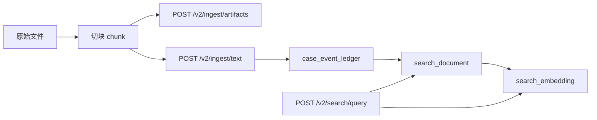

# TDB Gateway RAG 使用说明

本文档说明如何把文件内容导入 TDB，并通过 Gateway API 做检索增强生成（RAG）。

基于当前代码实现，推荐组合如下：

- 入库：
  - `POST /v2/ingest/artifacts`
  - `POST /v2/ingest/text`
- 检索：
  - `POST /v2/search/query`
- 主要表：
  - 文件元数据与版本：`artifact`, `artifact_version`
  - 检索投影：`search_document`, `search_embedding`
  - 底层事件账本：`case_event_ledger`

## 1. 设计结论

如果你的目标是“把文件放进 TDB 做 RAG”，推荐这样建模：

- 用 `artifact` / `artifact_version` 保存文件是谁、版本是什么、源文件在哪
- 用 `ingest/text` 把文件切块后的文本写成事件
- 用 `search/query` 做 lexical / vector / hybrid 检索

不要只把文件路径写进 `artifact_version.content_ref` 就结束。那只是文件登记，不是可检索知识。

也不要把 `search_document` 当唯一真相表。它在 schema 中就是搜索 projection，真正的写入入口仍然是 Gateway API。

## 2. 推荐数据流



推荐顺序：

1. 先创建文件和版本元数据
2. 再把文件切块文本写入 `ingest/text`
3. 查询时调用 `search/query`
4. 把返回命中的 chunk 拼成 prompt context

## 3. 表与 API 的职责

### 3.1 `artifact` / `artifact_version`

用途：

- 保存文件身份
- 保存版本号
- 保存源路径、对象存储 URL、hash
- 供后续引用、审计、版本切换

对应 API：

- `POST /v2/artifact/create`
- `POST /v2/artifact/version/create`
- 或批量方式 `POST /v2/ingest/artifacts`

推荐把这些信息放进去：

- `artifact.artifact_type`: 例如 `document`, `report`, `manual`, `knowledge_file`
- `artifact.name`: 文件名或业务名
- `artifact.description`: 文件说明
- `artifact_version.content_ref`: 原始文件路径、对象存储 URI、下载 URL
- `artifact_version.content_hash`: 文件 hash

### 3.2 `case_event_ledger`

用途：

- 底层事件事实表
- `ingest/text` 最终会写成 event
- 每个 chunk 一条 event

不建议直接对这个表做 RAG 查询；它更适合作为事实来源和回放来源。

### 3.3 `search_document` / `search_embedding`

用途：

- 真正承载 RAG 检索
- `search_document` 存文本和 metadata
- `search_embedding` 存向量

对应 API：

- 写入来源：`POST /v2/ingest/text`
- 查询入口：`POST /v2/search/query`

这是当前最适合 RAG 的表组合。

## 4. 最小接入方案

最小可行方案分两步：

1. 文件注册到 `artifact` / `artifact_version`
2. 文本切块写到 `ingest/text`

### 4.1 第一步：登记文件

建议用 `POST /v2/ingest/artifacts` 批量登记文件。

示例：

```json
{
  "stream_id": "rag.antique_expert",
  "items": [
    {
      "artifact_ref": "doc:ceramics-shortlist",
      "artifact": {
        "artifact_type": "document",
        "name": "ceramics-candidate-shortlist.md",
        "description": "古董陶瓷候选名单"
      },
      "versions": [
        {
          "version_number": 1,
          "status": "active",
          "valid_from": "2026-04-13T00:00:00Z",
          "content_ref": "/Users/ningwu/eis/a2a/agents/antique_expert/docs/ceramics-candidate-shortlist.md",
          "content_hash": "sha256:..."
        }
      ]
    }
  ]
}
```

返回里会带：

- `artifact_id`
- `artifact_version_ids`
- `ref_state_delta`

后面写 chunk 时，建议把 `artifact_id` 和 `artifact_version_id` 放进 chunk metadata。

### 4.2 第二步：切块后导入文本

推荐用 `POST /v2/ingest/text`。

每个 chunk 一条 `item`。

示例：

```json
{
  "stream_id": "rag.antique_expert",
  "generate_embedding": true,
  "event_type": "fact_observed",
  "items": [
    {
      "event_ref": "doc:ceramics-shortlist:chunk:0001",
      "text": "明代青花瓷器常见的胎质、釉色与纹饰特征包括……",
      "payload": {
        "artifact_ref": "doc:ceramics-shortlist",
        "artifact_id": "11111111-1111-1111-1111-111111111111",
        "artifact_version_id": "22222222-2222-2222-2222-222222222222",
        "file_path": "/Users/ningwu/eis/a2a/agents/antique_expert/docs/ceramics-candidate-shortlist.md",
        "title": "ceramics-candidate-shortlist.md",
        "chunk_index": 1,
        "chunk_total": 12,
        "section": "明代青花",
        "source": "local_file",
        "text": "明代青花瓷器常见的胎质、釉色与纹饰特征包括……"
      }
    }
  ]
}
```

说明：

- `text` 是 chunk 正文
- `payload.text` 也建议保留，当前实现会优先把文本写入 payload
- `generate_embedding=true` 时，Gateway 会按配置自动调 embedding 接口
- 如果你已经在外部算好了 embedding，也可以直接传 `items[].embedding`

## 5. 批量 ingest 接口说明

TDB Gateway 的批量导入接口不只有 `ingest/text`。  
当前共有 7 个批量 ingest 接口：

- `POST /v2/ingest/entities`
- `POST /v2/ingest/artifacts`
- `POST /v2/ingest/events`
- `POST /v2/ingest/text`
- `POST /v2/ingest/property`
- `POST /v2/ingest/edge`
- `POST /v2/ingest/bundle`

如果你的目标是做 RAG，最常用的是：

- `ingest/artifacts`
- `ingest/text`

但在更完整的数据建模里，另外几个接口也很有用。

### 5.1 通用结构

大多数批量 ingest 接口都有这些共同字段：

- `stream_id`
  - 这批数据属于哪个知识流或知识库
- `ingest_run_id?`
  - 本次导入的批次 ID
  - 不传时服务端会自动生成
- `dry_run?`
  - 为 `true` 时只做校验和模拟分配，不真正写库
- `items[]`
  - 批量导入的数据项

多数返回也有统一结构：

- `ingest_run_id`
- `stream_id`
- `accepted`
- `rejected`
- `errors[]`
- `ref_state_delta`
- `results[]`

其中：

- `accepted` 表示成功处理的条数
- `rejected` 表示失败条数
- `errors[]` 按 item 记录错误，包含 `index`, `code`, `message`
- `results[]` 保存成功项的结果
- `ref_state_delta` 是批量导入里最重要的辅助产物之一

### 5.2 `ref_state` 和 `ref_state_delta`

这套批量接口支持“先写 A，再在同一次导入流程里引用 A”的模式。

`ref_state` 本质上是一张引用名到真实 ID 的映射表，结构包括：

- `entity_ref_to_id`
- `artifact_ref_to_id`
- `artifact_ref_to_version_id`
- `event_ref_to_id`

工作方式是：

1. 前一个接口返回 `ref_state_delta`
2. 你把它并入本地 `ref_state`
3. 下一个接口调用时把 `ref_state` 带上
4. 后一个接口就可以通过 `xxx_ref` 引用前面创建的对象

例如：

1. `ingest/artifacts` 创建了 `artifact_ref = doc:ceramics-shortlist`
2. 返回 `artifact_ref_to_id` 和 `artifact_ref_to_version_id`
3. 后续 `ingest/text` 的 payload 中就能引用这个 artifact

再比如：

1. `ingest/text` 或 `ingest/events` 创建了 event
2. 返回 `event_ref_to_id`
3. 之后 `ingest/property` 和 `ingest/edge` 可以用 `source_event_ref` 关联来源事件

这对多阶段导入特别有用。

### 5.3 `ingest/entities`

用途：

- 批量创建或更新 entity
- 适合先建立业务对象目录

典型场景：

- 先导入人、组织、设备、物件等对象
- 后续事件、属性、边关系再引用这些 entity

关键字段：

- `entity_ref?`
- `entity_id?`
- `entity_type`
- `display_name`
- `external_refs?`
- `status?`

返回重点：

- `results[].entity_id`
- `ref_state_delta.entity_ref_to_id`

适合 RAG 的情况：

- 如果你的文件知识库里有稳定对象，例如“藏品”“作者”“窑口”“朝代”，可以先建 entity
- 之后 chunk metadata、property、edge 可以围绕这些 entity 建结构化关联

### 5.4 `ingest/artifacts`

用途：

- 批量创建 artifact 和 artifact_version
- 这是文件入库最重要的入口之一

典型场景：

- 批量登记一批文档
- 给文档打版本
- 记录源路径、hash、作者、审批人

关键字段：

- `artifact_ref?`
- `artifact.artifact_type`
- `artifact.name`
- `artifact.description?`
- `versions[]`
- `versions[].content_ref`
- `versions[].content_hash?`
- `versions[].author_id?` / `author_ref?`
- `versions[].approver_id?` / `approver_ref?`

返回重点：

- `results[].artifact_id`
- `results[].artifact_version_ids`
- `ref_state_delta.artifact_ref_to_id`
- `ref_state_delta.artifact_ref_to_version_id`

RAG 里最常用的做法：

- 每个源文件对应一个 artifact
- 每次文件更新对应一个新的 artifact_version

### 5.5 `ingest/events`

用途：

- 批量写事件
- 比 `ingest/text` 更底层、更通用

典型场景：

- 你已经自己完成结构化处理
- 你想显式传 `case_id` / `actor_id` / `subject_id` / `object_id`
- 你要导入的不只是文本，而是事件事实流

关键字段：

- `event_ref?`
- `case_id?` / `case_ref?`
- `event_type?`
- `actor_id?` / `actor_ref?`
- `subject_id?` / `subject_ref?`
- `object_id?` / `object_ref?`
- `payload?`
- `event_text?`
- `embedding?`
- `embedding_model?`
- `valid_time?`
- `system_time?`

返回重点：

- `event_ids[]`
- `results[].event_id`
- `ref_state_delta.event_ref_to_id`

和 `ingest/text` 的关系：

- `ingest/text` 最终内部会转成 `ingest/events`
- 如果你只是做文件 RAG，优先用 `ingest/text`
- 如果你要更强控制，才用 `ingest/events`

### 5.6 `ingest/text`

用途：

- 批量把文本导入为 event
- 这是 RAG 最推荐的 chunk 入库入口

典型场景：

- Markdown / TXT / JSON / PDF 抽取文本后做 chunk 入库
- 自动生成 embedding
- 最终进入搜索投影

关键字段：

- `generate_embedding?`
- `embedding_model?`
- `event_type?`
- `valid_time?`
- `system_time?`
- `items[].event_ref?`
- `items[].text`
- `items[].payload?`
- `items[].embedding?`

返回重点：

- `event_ids[]`
- `results[].event_id`
- `ref_state_delta.event_ref_to_id`

实现细节：

- 服务会把 `text` 复制到 event payload 中
- 如果没显式给 `event_type`，默认会用 `fact_observed`
- 若 `generate_embedding=true`，会调用配置里的 embedding 服务

### 5.7 `ingest/property`

用途：

- 批量写入对象属性状态
- 落到 `property_state`

典型场景：

- 给 entity 或其它对象补结构化属性
- 给文档或对象增加可按时间查询的属性

关键字段：

- `object_id?` / `object_ref?`
- `key`
- `value`
- `valid_from`
- `system_from?`
- `source_event_id?` / `source_event_ref?`
- `confidence?`

返回重点：

- `results[].property_state_id`

在 RAG 里的价值：

- 不直接承载 chunk 检索
- 但适合把“可筛选、可解释”的信息结构化下来
- 例如藏品的朝代、器型、材质、作者归属判断

### 5.8 `ingest/edge`

用途：

- 批量写对象之间的关系边
- 落到 `edge_state`

典型场景：

- 建立对象关系图
- 例如“作者-创作-作品”“器物-出土于-地点”“文档-提到-实体”

关键字段：

- `src_id?` / `src_ref?`
- `predicate`
- `dst_id?` / `dst_ref?`
- `valid_from`
- `system_from?`
- `source_event_id?` / `source_event_ref?`
- `confidence?`

返回重点：

- `results[].edge_state_id`

在 RAG 里的价值：

- 不直接用来做全文检索
- 但很适合做图谱增强、实体扩展召回和答案解释

### 5.9 `ingest/bundle`

用途：

- 一次请求里顺序执行多阶段导入
- 把 entities、artifacts、events、properties、edges 一起导入

这是最接近“批处理管道”的接口。

支持的字段块：

- `entities`
- `artifacts`
- `events`
- `properties`
- `edges`
- `defaults`

其中 `defaults` 目前可给事件和时态字段设默认值：

- `event_type`
- `valid_time`
- `system_time`

执行顺序是固定的：

1. `entities`
2. `artifacts`
3. `events`
4. `properties`
5. `edges`

也就是说：

- 前面阶段生成的 `ref_state_delta` 会自动合并
- 后面阶段可以直接引用前面阶段的 `xxx_ref`

返回结构不是单一 `results[]`，而是：

- `ingest_run_id`
- `stream_id`
- `ref_state`
- `totals`
- `phases`

其中：

- `ref_state` 是整次 bundle 执行后合并好的引用状态
- `totals` 是总 accepted / rejected / errors
- `phases` 包含每个子阶段各自的返回结果

如果你要做“一次性导入一个完整知识包”，`ingest/bundle` 很合适。  
如果你只做文件 RAG，通常单独调 `ingest/artifacts` + `ingest/text` 更直接。

### 5.10 RAG 场景下怎么选

推荐决策：

- 只做文件登记：`ingest/artifacts`
- 文件 chunk 入库：`ingest/text`
- 已有完整事件模型：`ingest/events`
- 要补结构化属性：`ingest/property`
- 要补对象关系：`ingest/edge`
- 要做一站式批处理：`ingest/bundle`

对大多数 RAG 场景，推荐最小组合仍然是：

1. `ingest/artifacts`
2. `ingest/text`
3. `search/query`

## 6. chunk 设计建议

RAG 的效果，主要取决于 chunk 质量。

推荐规则：

- chunk 长度：300 到 800 中文字，或 200 到 500 英文 tokens
- overlap：10% 到 20%
- 按自然结构切分：标题、段落、小节、表格说明
- 不要跨主题硬拼

推荐 metadata 字段：

- `artifact_id`
- `artifact_version_id`
- `file_path`
- `title`
- `chunk_index`
- `chunk_total`
- `section`
- `page`
- `tags`
- `source`
- `language`

推荐 event_ref 规则：

- `doc:<doc_key>:chunk:<0001>`

例如：

- `doc:ceramics-shortlist:chunk:0001`
- `doc:146-old-json:chunk:0007`

这样便于幂等导入和错误排查。

## 7. stream_id 怎么设计

`stream_id` 很重要，它既是隔离边界，也是检索过滤维度。

推荐做法：

- 每个知识库一个 `stream_id`
- 不同业务域分开
- 不同环境分开

示例：

- `rag.antique_expert`
- `rag.antique_expert.dev`
- `rag.docfood`
- `rag.manufacturing_demo`

如果你准备把多个文件混成一个知识库，放在同一个 `stream_id` 是合理的。  
如果你想严格隔离不同知识源，拆成多个 `stream_id` 更稳妥。

如果你的上层知识组织是按 `domain` 管理的，还要额外记住一条：

- `wiki` 层天然按 `domain` 组织
- `search/query` 底层仍然执行在 `stream_id`
- 所以需要维护一张正式的 `domain -> stream_ids` 绑定表

现在推荐做法是：

1. ingest 文本时确定它属于哪个 `domain`
2. 通过 `POST /v2/search/domain-stream/bind` 注册绑定
3. 查询时优先传 `domain`，由 gateway 自动解析为实际的 `stream_ids`

如果你使用层级命名空间，推荐用点号分隔层级：

- `kb.customer.bmw`
- `kb.customer.bmw.account.southafrica`
- `kb.customer.bmw.sales`

默认情况下，`stream_id` 是精确匹配。查询 `kb.customer.bmw` 不会自动包含子流。

需要包含子流时，在 `search/query` 里设置：

```json
{
  "query": "storage account notes",
  "stream_id": "kb.customer.bmw",
  "stream_prefix": true,
  "mode": "hybrid",
  "limit": 8
}
```

`stream_prefix: true` 会匹配命名节点本身和点号分隔的子节点：

- 匹配：`kb.customer.bmw`
- 匹配：`kb.customer.bmw.account.southafrica`
- 不匹配：`kb.customer.bmw2`
- 不匹配：`kb.customer.bmw-old`

这个规则使用点号边界，不使用 `LIKE` 通配符，所以 `%` 和 `_` 不会被解释成 wildcard。

## 8. 检索方法

查询接口用：

- `POST /v2/search/query`

示例：

```json
{
  "query": "明代青花瓷器的典型特征是什么",
  "stream_id": "rag.antique_expert",
  "mode": "hybrid",
  "limit": 8
}
```

可选参数：

- `mode`
  - `lexical`
  - `vector`
  - `hybrid`
- `domain`
- `limit`
- `stream_id`
- `stream_ids`
- `stream_prefix`
- `case_id`
- `query_embedding`
- `alpha`

返回每条 hit 包含：

- `doc_id`
- `case_id`
- `stream_id`
- `event_id`
- `event_seq`
- `content`
- `metadata`
- `lexical_score`
- `vector_score`
- `hybrid_score`

此外返回体里还会有：

- `resolved_stream_ids`

它表示这次查询最终真正使用了哪些 `stream_id`，适合拿来做调试和可观察性检查。

### 8.1 用 domain 查，而不是手写 stream_id

如果一个知识域下面挂了多个文档流，推荐这样查：

```json
{
  "query": "下埃及前王朝时期的主要遗址",
  "domain": "archeology_expert",
  "mode": "hybrid",
  "limit": 8
}
```

如果你既传了 `domain` 又传了 `stream_id/stream_ids`，gateway 会把它当成一个约束校验：

- 属于这个 domain 的流：允许继续查
- 不属于这个 domain 的流：直接报错

这样可以避免问答 agent 或人工调试时“不小心串到别的知识流”。

### 8.2 维护 domain-stream 绑定

注册绑定：

```json
POST /v2/search/domain-stream/bind
{
  "domain": "archeology_expert",
  "stream_id": "ch2_ancient_egypt_full",
  "binding_kind": "primary",
  "source": "pipeline_ingest_text_to_tdb"
}
```

查看绑定：

```text
GET /v2/search/domain-stream/list?domain=archeology_expert
```

取消绑定（逻辑失活，不是物理删除）：

```json
POST /v2/search/domain-stream/unbind
{
  "domain": "archeology_expert",
  "stream_id": "ch2_ancient_egypt_full"
}
```

## 9. 检索策略建议

默认建议：

- `mode = hybrid`
- `limit = 5 ~ 10`

适用场景：

- `lexical`
  - 关键词极强
  - 专有名词多
  - 文件 OCR 质量一般
- `vector`
  - 问题是自然语言表达
  - 同义改写较多
- `hybrid`
  - 大多数生产场景首选

如果你自己提供 `query_embedding`，可以减少 Gateway 侧额外依赖。  
如果不提供，则要确认后端检索链路能正常完成向量检索。

## 10. 生成阶段怎么用

RAG 典型流程：

1. 用户问题
2. 调 `POST /v2/search/query`
3. 取 Top-K chunk
4. 把 chunk 内容和 metadata 组装成 prompt context
5. 调 LLM 生成答案
6. 在答案里保留引用来源

建议给模型的上下文结构：

```text
[Chunk 1]
source: ceramics-candidate-shortlist.md
section: 明代青花
chunk_index: 1/12
content: ...

[Chunk 2]
source: 146-old.json
section: provenance
chunk_index: 7/20
content: ...
```

建议回答时引用：

- 文件名
- section
- chunk_index
- 必要时附 `artifact_version_id`

## 11. 推荐落地规范

### 11.1 文件类型

推荐统一为：

- Markdown
- JSON
- TXT
- HTML 抽取正文后文本
- PDF 抽取正文后文本

原则：

- 原始文件保存在外部路径或对象存储
- TDB 保存文件元数据、版本信息、chunk 文本和检索索引

### 11.2 content_ref

`artifact_version.content_ref` 推荐存：

- 本地绝对路径
- S3 URI
- HTTP URL
- 对象存储 key

例如：

- `/Users/ningwu/eis/a2a/agents/antique_expert/docs/ceramics-candidate-shortlist.md`
- `s3://my-bucket/rag/ceramics-candidate-shortlist.md`

### 11.3 content_hash

推荐存文件 hash，不存 chunk hash。

例如：

- `sha256:abcd...`

这有助于：

- 去重
- 版本识别
- 增量更新

## 12. 更新与重建策略

文件更新时，推荐：

1. 新建一个 `artifact_version`
2. 重新切块
3. 用新的 chunk 重新 `ingest/text`
4. chunk metadata 中写入新的 `artifact_version_id`

不要覆盖旧版本的 `artifact_version`。  
RAG 很依赖可追溯性，保留版本更稳。

如果你只做实验，也可以先粗暴重灌一个 `stream_id`。  
但生产场景更推荐版本化。

## 13. 常见坑

### 13.1 只登记 artifact，不导入 text

结果：

- 文件元数据存在
- 检索不到正文

### 13.2 chunk 太大

结果：

- 召回不准
- prompt 浪费上下文窗口

### 13.3 metadata 太少

结果：

- 召回后无法定位来源
- 无法做引用和去重

### 13.4 stream_id 混乱

结果：

- 检索结果串库
- 业务隔离困难

### 13.5 把 projection 当 source of truth

`search_document` / `search_embedding` 是检索投影，不应代替文件版本管理。

## 14. 当前配置要求

当前 `gateway.config.json` 中 embedding 已开启，模型配置为：

- `enabled: true`
- `model: qwen3-embedding:8b`
- `baseUrl: http://10.124.48.50:11434/v1`

这意味着：

- 调 `POST /v2/ingest/text` 时，可以让 Gateway 自动生成 embedding
- 如果 embedding 服务不可用，且 `strict: true`，导入可能失败

如果你不想依赖 Gateway 自动生成 embedding，可以自己算好后传 `items[].embedding`。

## 15. 推荐实践总结

最推荐的组合是：

- 文件元数据：`artifact` + `artifact_version`
- chunk 入库：`POST /v2/ingest/text`
- 检索：`POST /v2/search/query`
- 检索表：`search_document` + `search_embedding`

一句话总结：

`artifact/artifact_version` 管文件版本，`ingest/text` 管 chunk 入库，`search/query` 管 RAG 召回。

## 16. 最小操作清单

1. 准备文件
2. 抽文本
3. 按段落或标题切 chunk
4. 调 `POST /v2/ingest/artifacts` 记录文件与版本
5. 调 `POST /v2/ingest/text` 写入 chunk
6. 调 `POST /v2/search/query` 验证召回
7. 把 Top-K hits 送进 LLM 生成答案

## 17. 相关源码

- `/Users/ningwu/eis/tdb/gateway/src/api/v2/ingest.routes.ts`
- `/Users/ningwu/eis/tdb/gateway/src/api/v2/search.routes.ts`
- `/Users/ningwu/eis/tdb/gateway/src/services/ingest.service.ts`
- `/Users/ningwu/eis/tdb/gateway/src/services/event.service.ts`
- `/Users/ningwu/eis/tdb/gateway/src/schema/v2/ingest.ts`
- `/Users/ningwu/eis/tdb/gateway/src/schema/v2/search.ts`
- `/Users/ningwu/eis/tdb/db/migrations_v2/001_v2_baseline.sql`
